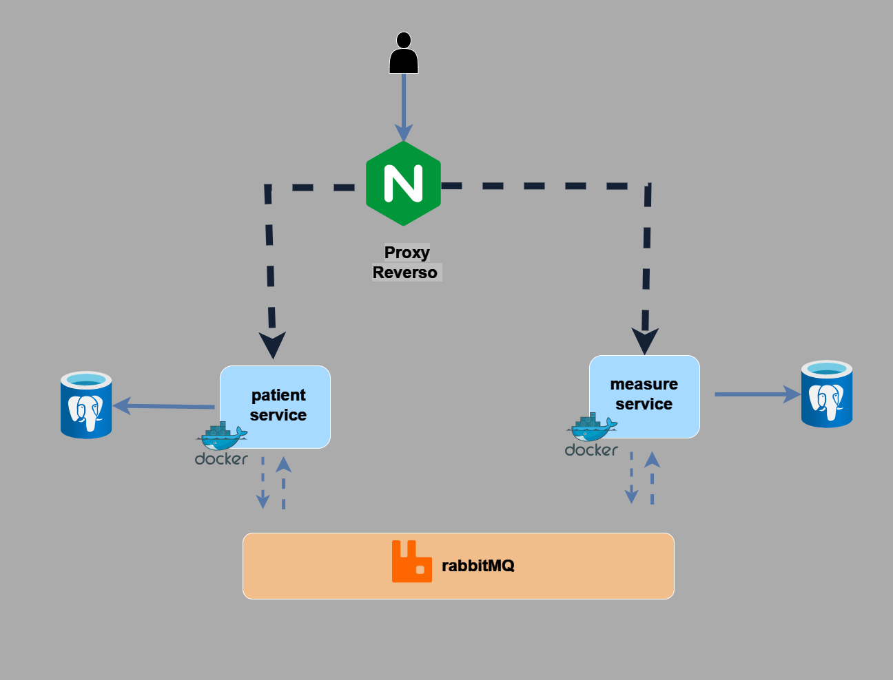

# Painkiller Software Engineer Challenge
<p align="center">
 
 
 
 
</p>

<!--ts-->
   * [Part 1: Backend](#backend)
      * [About](#about)
      * [Architecture](#architecture)
      * [How to run?](#how-to-run)
      * [API Documentation](#API-Documentation)
      * [Further steps](#further-steps)
   * [Part 2: Unit Testing](#unit-testing)
      * [About](#implementation)
      * [How to run?](#test-run)
   * [Part 3: Machine Learning](#unit-testing)
      * [Architecture Discussion (not implemented)](#implementation)
<!--te-->
## Backend
### About
 Painkiller is REST FastAPI with the following endpoints:
* ```POST /api/v1/patient```: Receive a new patient's data (name, age, medical conditions, etc.) in JSON format, store it in a database, and return the patient object with an assigned ID.

* `GET /api/v1/patient/<patient_id>`: Returns the data of the patient corresponding to the `patient_id`.

* `POST /api/v1/patient/<patient_id>/measurements`: Receives and stores health measurements (e.g., temperature, blood pressure) for the patient corresponding to the patient_id.

The API also provides the following endpoints for CRUD operations: 

* Patients:
* `POST /api/v1/patient/list`: Return list with data of all patient
* `POST /api/v1/patient/delete/<patient_id>`: Deletes the data of the patient corresponding to the patient_id.

* Measurements:
* `POST /api/v1/measurements/list`: Return list with data of all measures
* `POST /api/v1/measurements/delete/<patient_id>`: Deletes the data of the measures corresponding to the measures_id.

```
🚩For more details and payload examples, please check the api doc at:

    /api/v1/patient/docs#/
    /api/v1/measures/docs#/
```
### Architecture 
<p align="center">
 
 </p>

* Application is divided intotwo microservices: `patient_service` for managing patients and `measurement_service` for managing measurements.

* To maintain horizontal scale performance the processes are containerized (with docker), allowing application scaling process to be configured at microservice level.

* Postgres was adopted as the database. A relational database was chosen because it performs better in read-intensive applications. Each microservice has its own database. A schema overlay was planned on the `patient_service` to reduce network overhead between the microservices. A third base is used for unit tests.

* Rabbitmq was used as a messaging system between services

* NGINX was adopted as a reverse proxy
## How to run
 - Make sure you have installed `docker` and `docker-compose`
 - Run `docker-compose up -d`

* migrations:
 One running for first time, if necessary, DB can be initialized from alembic migrations, for instance:

 ```bash
docker-compose run --user 1000 measurement_service sh -c 'alembic upgrade head'
```

* application:
 application can be started running the following command:

 ```bash
cd /CodeChallenge.A3.Painkiller
docker-compose up --build'
```
## API Documentation

Swagger API Documentation can be found at 

```bash
/api/v1/patient/docs#/
```


```bash
/api/v1/measures/docs#/
```


# Unit Testing
## Implementation
1. **Unit Testing:** The unit tests for this application were built using the tdd methodology, using `pytest`. An postgressql service was configured as db test instance for test isolation.

## Test Run
Tests for each service can be run with the following command:

```bash
docker-compose run <container_service_name> sh -c "pytest -W ignore::DeprecationWarning"

```

Example for measurement_service:

```bash
docker-compose run measurement_service sh -c "pytest -W ignore::DeprecationWarning"

```

# Part 3: Machine Learning (Optional) - (Bonus)

## Architecture Discussion (not implemented)

The following architecture uses Azure infrastructure for discussion purpose only.


* Data Preparation: Apache Airflow ETL orchestration can used for sourcing, cleaning, and transforming and transfer data to `measurement data lake`. 

* Model Development: this includes core components of the model development process such as experiment tracking and model registration using MLflow.

* Model Deployment: this includes implementing a CI/CD pipeline to build and deploy solutions for batch inference workloads and online inference workloads. For online inference workloads, machine learning models can be containerized with docker as API services and deployed to an Azure Kubernetes cluster with Azure API Management exposing them to the outside world. 

* For batch inference workloads, jobs consuming the model will be executed using an orchestration tool (such as Apache Airflow).

* Model Monitoring: this includes monitoring the API performance and data drift by analyzing log telemetry with Grafana (Prometheus).

